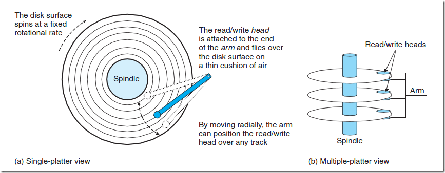

## 海量数据处理

所谓海量数据，就是数据量太大，要么在短时间内无法计算出结果，要么数据太大，无法一次性装入内存。

针对时间，我们可以使用巧妙的算法搭配合适的数据结构，如bitmap/堆/trie树等  
针对空间，就一个办法，大而化小，分而治之。常采用hash映射


* Hash映射/分而治之
* Bitmap
* Bloom filter(布隆过滤器)
* Trie树
* 数据库索引
* 倒排索引(Inverted Index)
* 双层桶划分
* 外排序
* simhash算法
* 分布处理之Mapreduce


### 估算

在处理海量问题之前，我们往往要先估算下数据量，能否一次性载入内存？如果不能，应该用什么方式拆分成小块以后映射进内存？每次拆分的大小多少合适？以及在不同方案下，大概需要的内存空间和计算时间。

比如,我们来了解下以下常见问题`时间` 和 `空间` 估算 :

```
8位的电话号码，最多有99 999 999个
IP地址
1G内存，2^32 ,差不多40亿，40亿Byte*8 = 320亿 bit

```


海量处理问题常用的分析解决问题的思路是：

* 分而治之/Hash映射 + hash统计/trie树/红黑树/二叉搜索树 + 堆排序/快速排序/归并排序
* 双层桶划分
* Bloom filter 、Bitmap
* Trie树/数据库/倒排索引
* 外排序
* 分布处理之 Hadoop/Mapreduce


### Hash映射/分而治之

这里的`Hash映射`是指通过一种映射散列的方式，将海量数据均匀分布在对应的内存或更小的文件中

使用hash映射有个最重要的特点是: `hash值相同的两个串不一定一样，但是两个一样的字符串hash值一定相等`。哈希函数如下：

```
int hash = 0;
for (int i=0;i<s.length();i++){
	hash = (R*hash +s.charAt(i)%M);
}
```

大文件映射成多个小文件。具体操作是，比如要拆分到100(M)个文件：

1. 对大文件中的每条记录求hash值，然后对M取余数，即 `hash(R)%M`，结果为K
2. 将记录R按结果K分配到第K个文件，从而完成数据拆分

这样，两条相同的记录肯定会被分配到同一个文件。


### Bitmap

也就是用1个(或几个)bit位来标记某个元素对应的value(如果是1bitmap，就只能是元素是否存在;如果是x-bitmap,还可以是元素出现的次数等信息)。使用bit位来存储信息，在需要的存储空间方面可以大大节省。应用场景有：


1. 排序（如果是1-bitmap,就只能对无重复的数排序）
2. 判断某个元素是否存在

比如，某文件中有若干8位数字的电话号码，要求统计一共有多少个不同的电话号码？

分析：8位最多99 999 999, 如果1Byte表示1个号码，需要95MB空间，但是如果1bit表示1个号码，则只需要 95/8=12MB 的空间。这时，数字k(0~99 999 999)与bit位的对应关系是：

```
#define SIZE 15*1024*1024
char a[SIZE];
memset(a,0,SIZE);

// a[k/8]这个字节中的 `k%8` 位命中,置为1
// 这里要注意 big-endian 和  little-endian的问题 ，假设这里是big-endian
a[k/8] = a[k/8] | (0x01 << (k%8))

```


### Bloom filter(布隆过滤器)

Bloom Filter是由Bloom在1970年提出的一种多哈希函数映射的快速查找算法。通常应用在一些需要快速判断某个元素是否属于集合，但是并不严格要求100%正确的场合。


##### Bloom filter 特点

为了说明Bloom Filter存在的重要意义，举一个实例：假设要你写一个网络蜘蛛（web crawler）。由于网络间的链接错综复杂，蜘蛛在网络间爬行很可能会形成“环”。为了避免形成“环”，就需要知道蜘蛛已经访问过那些URL。给一个URL，怎样知道蜘蛛是否已经访问过呢？稍微想想，就会有如下几种方案：

1. 将访问过的URL保存到数据库。
2. 用HashSet将访问过的URL保存起来。那只需接近O(1)的代价就可以查到一个URL是否被访问过了。
3. URL经过MD5或SHA-1等单向哈希后再保存到HashSet或数据库。
4. BitMap方法。建立一个BitSet，将每个URL经过一个哈希函数映射到某一位。

方法1~3都是将访问过的URL完整保存，方法4则只标记URL的一个映射位。以上方法在数据量较小的情况下都能完美解决问题，但是当数据量变得非常庞大时问题就来了。

方法1的缺点：数据量变得非常庞大后关系型数据库查询的效率会变得很低。而且每来一个URL就启动一次数据库查询是不是太小题大做了？  
方法2的缺点：太消耗内存。随着URL的增多，占用的内存会越来越多。就算只有1亿个URL，每个URL只算50个字符，就需要5GB内存。  
方法3：由于字符串经过MD5处理后的信息摘要长度只有128Bit，SHA-1处理后也只有160Bit，因此方法3比方法2节省了好几倍的内存。  
方法4消耗内存是相对较少的，但缺点是单一哈希函数发生冲突的概率太高。还记得数据结构课上学过的Hash表冲突的各种解决方法么？若要降低冲突发生的概率到1%，就要将BitSet的长度设置为URL个数的100倍。 

实质上上面的算法都忽略了一个重要的隐含条件：允许小概率的出错，不一定要100%准确！也就是说少量url实际上没有没网络蜘蛛访问，而将它们错判为已访问的代价是很小的——大不了少抓几个网页呗。 


##### Bloom filter 算法

Bloom filter可以看做是对bitmap的扩展。只是使用多个hash映射函数，从而减低hash发生冲突的概率。算法如下:

1. 创建 m 位的bitset，初始化为0， 选中k个不同的哈希函数
2. 第 i 个hash 函数对字符串str 哈希的结果记为 h(i,str) ,范围是（0，m-1）
3. 将字符串记录到bitset的过程：对于一个字符串str,分别记录h(1,str),h(2,str)...,h(k,str)。 然后将bitset的h(1,str),h(2,str)...,h(k,str)位置1。也就是将一个str映射到bitset的 k 个二进制位。

4. 检查字符串是否存在:对于字符串str，分别计算h(1，str)、h(2，str),...,h(k，str)。然后检查BitSet的第h(1，str)、h(2，str),...,h(k，str) 位是否为1，若其中任何一位不为1则可以判定str一定没有被记录过。若全部位都是1，则“认为”字符串str存在。但是若一个字符串对应的Bit全为1，实际上是不能100%的肯定该字符串被Bloom Filter记录过的。（因为有可能该字符串的所有位都刚好是被其他字符串所对应）这种将该字符串划分错的情况，称为false positive 。

5. 删除字符串:字符串加入了就被不能删除了，因为删除会影响到其他字符串。实在需要删除字符串的可以使用Counting bloomfilter(CBF)。


`Bloom Filter 使用了k个哈希函数，每个字符串跟k个bit对应。从而降低了冲突的概率。`


##### 最优的哈希函数个数，位数组m大小

哈希函数的选择对性能的影响应该是很大的，一个好的哈希函数要能近似等概率的将字符串映射到各个Bit。选择k个不同的哈希函数比较麻烦，一种简单的方法是选择一个哈希函数，然后送入k个不同的参数。

在原始个数位n时，那这里的k应该取多少呢？位数组m大小应该取多少呢？这里有个计算公式:`k=(ln2)*(m/n)`, 当满足这个条件时，错误率最小。


假设错误率为0.01， 此时m 大概是 n 的13倍，k大概是8个。 这里的n是元素记录的个数，m是bit位个数。如果每个元素的长度原大于13，使用Bloom Filter就可以节省内存。


##### 错误率估计


##### 实现示例

```
#define SIZE 15*1024*1024
char a[SIZE]; /* 15MB*8 = 120M bit空间 */
memset(a,0,SIZE);

int seeds[] = { 5, 7, 11, 13, 31, 37, 61};

int hashcode(int cap,int seed, string key){
	int hash = 0;
	for (int i=0;i<key.length();i++){
		hash = (seed*hash +key.charAt(i));
	}
	return hash & (cap-1);
}
```

对每个字符串str求哈希就可以使用 `hashcode(SIZE*8,seeds[i],str)` ,i 的取值范围就是 （0，k）。


##### Bloom filter应用 

* 拼写检查一类的字典应用
* 数据库系统
* 网络领域（爬虫，web cache sharing）


##### 参考  
http://www.cnblogs.com/heaad/archive/2011/01/02/1924195.html  
http://blog.csdn.net/jiaomeng/article/details/1495500    
http://pages.cs.wisc.edu/~cao/papers/summary-cache/node8.html  `哈希函数个数k、位数组大小m` 测试论证


### Trie树

字典树，英文名Trie树，Trie一词来自retrieve，发音为/tri:/ “tree”，也有人读为/traɪ/ “try”，
又称单词查找树，Trie树，是一种树形结构（多叉树）。

trie，又称为前缀树或字典树，是一种有序树，用于保存关联数组。

##### trie基本

1. 除根节点不包含字符，每个节点都包含一个字符
2. 从根节点到某一个节点，路径上经过的字符连接起来，为该节点对应的字符串
3. 每个节点的所有子节点包含的字符都不相同（保证每个节点对应的字符串都不一样）

比如：

```
                    / \    
                   / | \
                  t  a  i                
                /  \     \
               o    e     n
                   /|\    /
                  a d n  n                
```

上面的Trie树，可以表示字符串集合{“a”, “to”, “tea”, “ted”, “ten”, “i”, “in”, “inn”} 。

trie树把每个关键字保存在一条路径上，而不是一个节点中  
两个有公共前缀的关键字，在Trie树中前缀部分的路径相同，所以Trie树又叫做前缀树（Prefix Tree）。  


##### trie树存储结构和基本操作

最简单实现 ---- 26个字母表 a-z (没有考虑数字，大小写，其他字符如=-*/)

子树用数组存储，浪费空间；如果系统中存在大量字符串，且这些字符串基本没有公共前缀，trie树将消耗大量内存  
如果用链表存储，查询时需要遍历链表，查询效率有所降低  

```
define ALPHABET_NUM 26
typedef struct trie_node{
   char value;
   bool isKey;/*是否代表一个关键字*/
   int count; /*可用于词频统计，表示关键字出现的次数*/
   struct Node *subTries[ALPHABET];
}*Trie

Trie Trie_create();
int Trie_insert(Trie trie,char *word); // 插入一个单词
int Trie_search(Trie trie,char *word);// 查找一个单词
int Trie_delete(Trie trie,char *word);// 删除一个单词

Trie Trie_create(){
    trie_node* pNode = new trie_node();
    pNode->count = 0;
    for(int i=0; i<ALPHABET_SIZE; ++i)
        pNode->children[i] = NULL;
    return pNode;
}

void trie_insert(trie root, char* key)
{
    trie_node* node = root;
    char* p = key;
    while(*p)
    {
        if(node->children[*p-'a'] == NULL)
        {
            node->children[*p-'a'] = create_trie_node();
        }
        node = node->children[*p-'a'];
        ++p;
    }
    node->count += 1;
}

/**
 * 查询：不存在返回0，存在返回出现的次数
 */ 
int trie_search(trie root, char* key)
{
    trie_node* node = root;
    char* p = key;
    while(*p && node!=NULL)
    {
        node = node->children[*p-'a'];
        ++p;
    }
    
    if(node == NULL)
        return 0;
    else
        return node->count;
}

```

trie树的增加和删除都比较麻烦，但索引本身就是写少读多，是否考虑添加删除的复杂度上升，依靠具体场景决定。  


##### trie 问题

它的优点是： 

1. 插入和查询的效率很高，都是O(m),其中 m 是待插入/查询的字符串的长度
2. Trie树可以对关键字按字典序排序  
3. 利用字符串的公共前缀来最大限度地减少无谓的字符串比较,提高查询效率

缺点：

1. trie 树比较费内存空间，在处理大数据时会内存吃紧
2. 当hash函数较好时，Hash查询效率比 trie 更优

[知乎这里](http://www.zhihu.com/question/27168319)有个问题：`10万个串找给定的串是否存在`, 对trie和hash两种方案给出了讨论。 

[DATrie](https://github.com/kmike/datrie) 是使用python实现的双数组trie树， 双数组可以减少内存的使用量  。有关 double-array trie，可以参考[这篇论文](http://linux.thai.net/~thep/datrie/datrie.html)
  

##### trie应用

典型应用是：前缀查询,字符串查询，排序  
  
* 用于统计，排序和保存大量的字符串（但不仅限于字符串）  
* 经常被搜索引擎系统用于文本词频统计  
* 排序大量字符串   
* 用于索引结构  
* 敏感词过滤


### 数据库索引

索引使用的数据结构多是B树或B+树。B树和B+树广泛应用于文件存储系统和数据库系统中，mysql使用的是B+树，oracle使用的是B树，Mysql也支持多种索引类型，如b-tree 索引，哈希索引，全文索引等。

一般来说，索引本身也很大，不可能全部存储在内存中，因此索引往往以索引文件的形式存储的磁盘上。索引查找过程中就要产生磁盘I/O消耗，相对于内存存取，I/O存取的消耗要高几个数量级，所以评价一个数据结构作为索引的优劣最重要的指标就是在查找过程中磁盘I/O操作次数的渐进复杂度。换句话说，索引的结构组织要尽量减少查找过程中磁盘I/O的存取次数。


##### 磁盘数据查找过程



盘面：每一个盘片都有2个上下盘面，每个盘面都可以存储数据

柱面：所有盘面上的同一磁道构成一个圆柱，叫做柱面。磁盘读写按柱面进行;
只在同一柱面所有的磁头全部读/写完毕后磁头才转移到下一柱面，因为选取磁头只需通过电子切换即可，而选取柱面则必须通过机械切换。电子切换相当快，比在机械上磁头向邻近磁道移动快得多，所以，数据的读/写按柱面进行，而不按盘面进行。也就是说，一个磁道写满数据后，就在同一柱面的下一个盘面来写，一个柱面写满后，才移到下一个扇区开始写数据。读数据也按照这种方式进行，这样就提高了硬盘的读/写效率。

磁道：磁盘在格式化时被划分出许多同心圆，这些同心圆轨迹叫做磁道 track。磁道从外向内从0开始编号。

扇区：信息以脉冲串的形式记录在这些轨迹中，这些同心圆不是连续记录数据，而是被划分成一段段圆弧，每段圆弧叫做一个扇区，扇区从“1”开始编号 。扇区也叫块号。

磁盘在物理上划分为柱面, 磁道，扇区。想要读取扇区的数据，需要将磁头放到这个扇区上方:

1. 先找到柱面，也就是寻道。磁头是不能动的，但可以沿着磁盘半径方向运动，耗时记为寻道事件 t(seek)
2. 将目标扇区旋转到磁头下，这个过程耗时是旋转时间t(r)

一个磁盘扇区数据读取的时间t = t(seek)+t(r)+t(数据传输) , 在数据库查找数据时，查找时间与访问的磁盘盘块成正比，内存处理时间可以忽略不计。


##### B树

2-3树：一个节点最多有2个key，红黑树就是2-3树的一种实现。

B树又叫多路平衡查找树。B树可以看做是对2-3树的扩展，允许每个节点有M-1个key，并以升序排列，这里的M就是B树的阶。


B树的度d(d>=2) ，有一些特征：

1. 根节点至少有2个子节点
2. 所有的叶节点具有相同的深度 h，也就是树高
3. 每个叶子节点至少包含一个key和2个指针，最多2d-1个key和2d个指针，叶节点的指针都是null。每个节点的关键字个数在【d-1,2d-1】之间
4. 每个非叶子节点，key和指针互相间隔，节点两端是指针，因此节点中指针个数=key的个数+1
5.  每个指针要么是null，要么指向另一个节点

如果某个指针在节点node最左边且不为null，则其指向节点的所有key小于v(key1)，其中v(key1)为node的第一个key的值。
如果某个指针在节点node最右边且不为null，则其指向节点的所有key大于v(keym)，其中v(keym)为node的最后一个key的值。
如果某个指针在节点node的左右相邻key分别是keyi和keyi+1且不为null，则其指向节点的所有key小于v(keyi+1)且大于v(keyi)。


使用数据结构表示如下：

```
typedef struct Item{
     int key;
     Data data;
}

#define m 3 //B树的阶

typedef struct BTNode{
    int degree; //B树的度
    int keynums; //每个节点key的个数
     Item  items[m];
     struct BTNode *p[m];
}BTNode,* BTree;

typedef struct{
     BTNode *pt; //指向找到的节点
     int i; // 节点中关键字的序号 (0,m-1)
     int tag; //1:查找成功，0：查找失败
}Result;

Status btree_insert(root,target);
Status btree_delete(root,target);
Result btree_find(root,target);

```

##### 建立索引

当为一张空表创建索引时，数据库系统将为你分配一个索引页，该索引页在你插入数据前一直是空的。此页此时既是根结点，也是叶结点。每当你往表中插入一行数据，数据库系统即向此根结点中插入一行索引记录。

插入和删除新的数据记录都会破坏B-Tree的性质，因此在插入删除时，需要对树进行一个分裂、合并、转移等操作以保持B-Tree性质

##### 查找操作

从root节点出发，对每个节点，找到等于target的key，则查找成功；或者找到大于target的最小k[i], 到 k[i] 左指针指向的子节点继续查找，直到页节点，如果找不到，说明关键字target不在B树中。

分析下时间复杂度：

对于一个度为d的B-Tree,每个节点的索引key个数是d-1, 索引key个数为N，树高h上限是：

2d^h-1=N ==> h=logd^((N+1) /2) ？？？

因此，检索一个key，查找节点的个数的复杂度是O(logd^N)

```
比如d=2，N=1,000,000 (1百万)，h差不多20个
d=3,N=1,000,000 (1百万) ,h差不多13个(3^11=1,594,323)
d=4,N=1,000,000 (1百万) ,h差不多10个
d=5,N=1,000,000 (1百万) ,h差不多9个 (5^9 = 1,953,125)
d=6,N=1,000,000 (1百万) ,h差不多8个(6^8 = 1,679,616)
d=7,N=1,000,000 (1百万) ,h差不多8个
d=8,N=1,000,000 (1百万) ,h差不多7个
d=9,N=1,000,000 (1百万) ,h差不多7个
d=10,N=1,000,000 (1百万) ,h差不多6个
d=100时，h差不多3个
```

数据库系统在设计时，通常将一个节点的大小设为一个页大小(通常4k)，这样保证一个节点在物理上也存储在一个页里，加上计算机存储分配都是按页对其，这样保证一个节点只需要一次I/O.

实际应用中，d都是比较大，通常超过100，因此1百万的数据通常最多访问3个节点，也就是3次I/O, 因此使用B树作为索引结构查询效率非常高。


##### 插入数据

插入数据时，需要更新索引，索引中也要添加一条记录。索引中添加一条记录的过程是：

沿着搜索的路径从root一直到叶节点

每个节点的关键字个数在【d-1,2d-1】之间，当节点的关键字个数是2t-1时，再加入target就违反了B树定义，需要对该节点进行分裂：已中间节点为界，分成2个包含d-1个关键字的子节点（另外还有一个分界关键字，2*(d-1)+1=2d-1），同时把该分界关键字提升到该叶子的父节点中，如果这导致父节点关键字个数超过2d-1,就继续向上分裂，直到根节点。

如下演示动画，往度d=2的B树中插入：` 6 10 4 14 5 11 15 3 2 12 1 7 8 8 6 3 6 21 5 15 15 6 32 23 45 65 7 8 6 5 4`


##### B树和B+树的区别

B树和B+树的区别在于：

1. B+树的非叶子节点只包含导航信息，不包含实际记录的信息，这可以保证一个固定大小节点可以放入更多个关键字，也就是更大的度d，从而树高h可以更小，从而相比B树有更优秀的查询效率
2. 所有的叶子节点和相邻的节点使用链表方式相连，便于区间查找和遍历


### 倒排索引(Inverted Index)

也叫反向索引。是文档检索系统中最常用的数据结构。常规的索引是文档到关键词的映射，如果对应的文档是


[Elasticsearch](https://github.com/elastic/elasticsearch)就是使用倒排索引(inverted index)的结构来做快速的全文搜索。ElasticSearch 不仅用于全文搜索, 还有非常强大的统计功能 (facets)。

携程，58，美团的分享中都提到ES构建实时日志系统，帮助定位系统问题。


[Elasticsearch权威指南](http://es.xiaoleilu.com/index.html)

### 双层桶划分


### 外排序


### simhash算法


### 分布处理之Mapreduce


##### Hadoop


